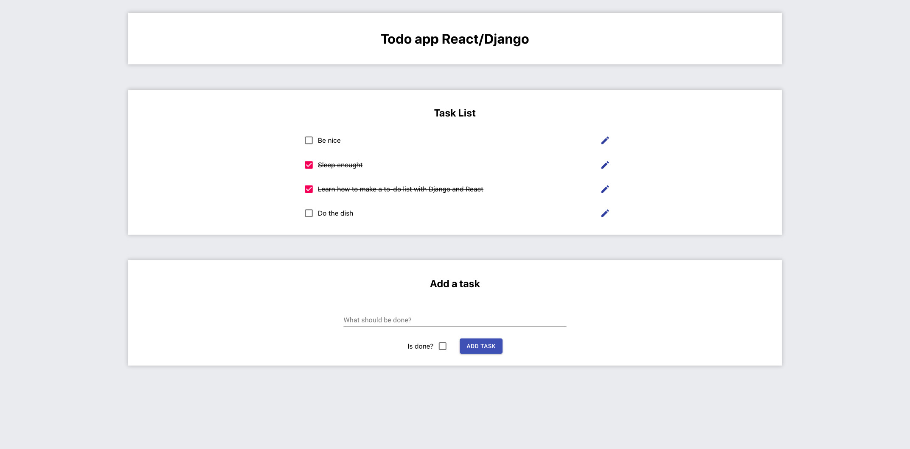

# to-do-list-django-react
This is a simple TODO app.

## Screenshot


## Techno
back-end: Django
DB: sqlite
Front: React

## Instal
1. Install the react app:
Go to front-end folder and run

```shell
npm install
npm run build
```

2. Install the Django dependencies
Install all the python dependencies. Python3 in required.
```shell
pip3 install -r requirements.txt
```

The Django server is linked to the react build. Just tun the Django server with:
```shell
python manage.py runserver
```

## Usage
### User side
To access to the todo-list go to http://localhost:8000/
### Admin side
To access to the admin panel go to http://localhost:8000/admin and connect with these logs:
```
login: root
password: root
```

### API
To access to the API go to http://localhost:8000/api
Then you can access to all these routes:
```
"List": "/task-list/",
"Detail View": "/task-detail/<str:pk>/",
"Create": "/task-create/",
"Update": "/task-update/<str:pk>/",
"Delete": "/task-delete/<str:pk>/"
```
